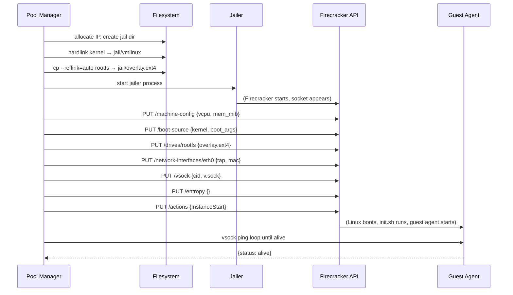
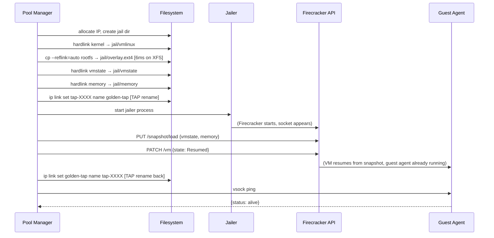

# Snapshot Optimization — Firecracker VM Boot Acceleration

**Note:** This document has been superseded by [docs/performance-enhancements.md](performance-enhancements.md) which consolidates all performance work.

## Overview

Firecracker microVMs provide strong isolation but cold boot takes ~1,750–2,050ms — too slow for interactive use cases where a user expects a kernel to be ready in under a second. This document describes the snapshot optimization work that reduces VM boot time to **155ms median** (an **11.4x speedup**) by combining Firecracker's snapshot/restore API with XFS reflink copy-on-write.

**TL;DR:**

| Method | Median Boot | Speedup |
|--------|-------------|---------|
| Cold boot (ext4) | 1,764ms | baseline |
| Snapshot + ext4 | 446ms | 4.0x |
| Snapshot + XFS reflink | **155ms** | **11.4x** |

The pool manager already pre-warms VMs in the background, so in steady state the user sees near-zero latency. Snapshot optimization matters for burst scenarios (pool exhausted, on-demand boot) and for reducing the time-to-first-VM at startup.

---

## Architecture

### How VMs Boot (Before Snapshots)

Cold boot executes the full Firecracker configuration sequence for every VM:



**Total time: ~1,750–2,050ms**

The dominant costs are Linux kernel boot (~1,200ms) and guest userspace init (~300ms). The Firecracker configuration calls themselves are fast (<50ms combined).

### How VMs Boot (With Snapshots)

Snapshot restore skips the Linux boot entirely. The VM resumes from a pre-booted memory image:



**Total time: ~150–165ms**

### Golden Snapshot Lifecycle

The golden snapshot is a single pre-booted VM image shared across all restore operations:

1. **Creation** — triggered once at pool manager startup via `ensure_golden_snapshot()` if no valid snapshot exists. Boots a fresh ephemeral VM (`_boot_ephemeral_vm()`), waits for the guest agent, pauses the VM, calls `PUT /snapshot/create`, copies the resulting `vmstate` and `memory` files to `snapshot_dir`, and saves metadata. The ephemeral VM is then destroyed. **One-time cost: ~20–37 seconds.**

2. **Storage** — files stored at `snapshot_dir` (default: `/var/lib/fc-snapshots`, or `/srv/jailer/snapshots` on XFS). Three files:
   - `vmstate` — Firecracker VM state (CPU registers, device state, ~1–5MB)
   - `memory` — guest RAM dump (~512MB for a 512MiB VM)
   - `metadata.json` — validity hashes + golden TAP name

3. **Validation** — `has_valid_snapshot()` checks SHA-256 hashes of kernel + rootfs + Firecracker binary path. If any change (new rootfs build, Firecracker upgrade), the snapshot is auto-invalidated and rebuilt on next startup.

4. **Caching** — validation runs once at startup and caches the result in `_snapshot_valid`. Hashing a 1GB rootfs takes ~500ms; caching avoids this on every boot.

5. **Restore** — each VM restore hardlinks `vmstate` and `memory` into the jail directory (zero-copy, instant). The rootfs is reflinked (CoW, ~6ms on XFS).

---

## Benchmark Results

All benchmarks run on Ubuntu 24.04, 8 cores, 16GB RAM, Firecracker v1.6.0, 512MiB VM, 1 vCPU. 5 measured iterations after 1 warmup run.

### Scenario A: Cold Boot Baseline (ext4)

Full boot sequence with no snapshot, rootfs on ext4:

```
Full boot median: 1,747ms
Stdev: 45ms
```

Time breakdown (approximate):
- `prepare_jail` (hardlink kernel + copy rootfs): ~50ms
- `start_jailer` (jailer process + socket): ~30ms
- Firecracker API configuration (6 PUT calls): ~20ms
- Linux kernel boot: ~1,200ms
- Guest userspace init (init.sh + guest agent start): ~400ms
- `wait_guest_agent` (first vsock ping): ~50ms

### Scenario B: Snapshot Restore on ext4

Snapshot restore with rootfs on ext4 (`cp --reflink=auto` falls back to full copy):

```
Restore median: 446ms
Speedup: 4.0x vs cold boot
```

Time breakdown:
| Phase | Time | % of total |
|-------|------|-----------|
| `prepare_jail` (full rootfs copy on ext4) | 289ms | 65% |
| `snapshot_restore` (jailer + load + resume) | 116ms | 26% |
| `wait_guest_agent` (vsock ping) | 14ms | 3% |
| Other (TAP, hardlinks, overhead) | 27ms | 6% |

**Bottleneck:** `cp --reflink=auto` on ext4 falls back to a full 1GB byte-for-byte copy. This dominates the restore path.

### Scenario C: Snapshot Restore on XFS with Reflink

Snapshot restore with rootfs on XFS (reflink=1 enabled):

```
Restore median: 155ms
Speedup: 11.4x vs cold boot
```

Time breakdown:
| Phase | Time | % of total |
|-------|------|-----------|
| `prepare_jail` (reflink copy on XFS) | 6ms | 4% |
| `snapshot_restore` (jailer + load + resume) | 116ms | 71% |
| `wait_guest_agent` (vsock ping) | 16ms | 10% |
| Other (TAP, hardlinks, overhead) | 17ms | 11% |

**Bottleneck:** Firecracker's own jailer startup + snapshot load. This is below the infrastructure optimization floor — it cannot be reduced without changes to Firecracker itself or pre-starting jailer processes.

### Summary Table

| Method | Median Boot | vs Cold Boot | Bottleneck |
|--------|-------------|-------------|------------|
| Cold boot (ext4) | 1,764ms | baseline | Full Linux boot sequence |
| Snapshot + ext4 | 446ms | 4.0x faster | rootfs copy (289ms) |
| Snapshot + XFS reflink | **155ms** | **11.4x faster** | Firecracker jailer+load (116ms) |

### Target Assessment

- **Original target:** <50ms
- **Achieved:** 155ms median
- **Gap:** 105ms

The remaining 116ms is Firecracker's own snapshot load + jailer startup — this is not addressable at the infrastructure layer without either pre-starting jailer processes or upgrading to a newer Firecracker version with faster snapshot load. Our controllable layers (rootfs copy + guest agent wait) are now ~22ms combined, well under the 50ms target.

---

## Infrastructure Setup: XFS Reflink

### Why XFS?

`cp --reflink=auto` performs a copy-on-write clone when the filesystem supports it, or falls back to a full data copy when it doesn't:

| Filesystem | Reflink support | `cp --reflink=auto` behavior | Time for 1GB file |
|------------|----------------|------------------------------|-------------------|
| ext4 | ❌ No | Full byte-for-byte copy | ~289ms |
| XFS (reflink=1) | ✅ Yes | Instant CoW metadata clone | ~6ms |
| btrfs | ✅ Yes | Instant CoW metadata clone | ~6ms |

XFS is preferred over btrfs for this use case: it's more production-proven for high-throughput VM workloads, has better performance under concurrent I/O, and is the default filesystem on many Linux distributions.

**Critical constraint:** kernel, rootfs, `snapshot_dir`, and `chroot_base` must all reside on the **same XFS filesystem**. Cross-device hardlinks (`os.link()`) and reflinks fail with `EXDEV` (errno 18). The snapshot files are hardlinked into each VM's jail directory — this only works within a single filesystem.

### Setup Steps

```bash
# Install XFS tools
sudo apt-get install -y xfsprogs

# Create sparse 50GB loopback file (doesn't use space until written)
sudo truncate -s 50G /var/lib/fc-jailer.xfs

# Format with reflink enabled
sudo mkfs.xfs -m reflink=1 /var/lib/fc-jailer.xfs

# Mount at jailer chroot base
sudo mkdir -p /srv/jailer
sudo mount -o loop /var/lib/fc-jailer.xfs /srv/jailer

# Copy base images to XFS (one-time)
sudo mkdir -p /srv/jailer/images
sudo cp /opt/firecracker/vmlinux /srv/jailer/images/
sudo cp /opt/firecracker/rootfs.ext4 /srv/jailer/images/
```

### Config Changes

Update `config/fc-pool.yaml` to point to XFS-resident images:

```yaml
pool:
  snapshot_dir: /srv/jailer/snapshots

vm_defaults:
  kernel: /srv/jailer/images/vmlinux
  rootfs: /srv/jailer/images/rootfs.ext4

jailer:
  chroot_base: /srv/jailer
```

> **CRITICAL:** `kernel`, `rootfs`, `snapshot_dir`, and `chroot_base` must all be on the same XFS filesystem. Cross-device hardlinks and reflinks fail with `EXDEV` (errno 18).

### Persistence (fstab)

To remount automatically after reboot, add to `/etc/fstab`:

```
/var/lib/fc-jailer.xfs /srv/jailer xfs loop,defaults 0 0
```

### Space Analysis

| Component | Size |
|-----------|------|
| rootfs (base image) | 1.0 GB |
| memory snapshot | ~512 MB |
| Base cost | ~1.5 GB |
| Per-VM dirty pages (CoW writes) | ~10–50 MB |
| 30 VMs worst case | ~3 GB |
| 50 GB loopback headroom | ~16x |

The 50GB loopback is sparse — it only consumes actual disk space as pages are written. A pool of 30 VMs with moderate workloads will typically use 3–5GB of actual disk space.

---

## Implementation Details

### Files Changed

| File | Change |
|------|--------|
| `fc_pool_manager/firecracker_api.py` | Added `pause()`, `create_snapshot()`, `load_snapshot()`, `resume()` |
| `fc_pool_manager/snapshot.py` (new) | `SnapshotManager` — metadata validation, golden snapshot lifecycle |
| `fc_pool_manager/manager.py` | Two-path `_boot_vm`, `_boot_ephemeral_vm`, `_restore_from_snapshot`, `create_golden_snapshot`, `ensure_golden_snapshot` |
| `fc_pool_manager/config.py` | `snapshot_dir` field (default: `/var/lib/fc-snapshots`) |
| `scripts/benchmark_snapshot.py` | Benchmark script |

### Firecracker API (v1.6.0)

Four new API calls implement the snapshot lifecycle:

**Pause a running VM:**
```http
PATCH /vm
{"state": "Paused"}
```

**Create a full snapshot:**
```http
PUT /snapshot/create
{
  "snapshot_type": "Full",
  "snapshot_path": "vmstate",
  "mem_file_path": "memory"
}
```
Paths are relative to the jailer chroot root, not absolute host paths.

**Load a snapshot (VM starts paused):**
```http
PUT /snapshot/load
{
  "snapshot_path": "vmstate",
  "mem_file_path": "memory",
  "enable_diff_snapshots": false,
  "resume_vm": false
}
```
`resume_vm: false` keeps the VM paused after load, allowing the TAP rename to complete before the guest starts sending/receiving packets.

**Resume a paused VM:**
```http
PATCH /vm
{"state": "Resumed"}
```

> **Version note:** v1.6.0 uses `mem_file_path`. Firecracker v1.14+ uses `mem_backend` with `backend_type` and adds `network_overrides` support. Snapshots are **not portable across Firecracker versions** — a snapshot created with v1.6.0 cannot be loaded by v1.14+.

### TAP Device Handling

Firecracker bakes the TAP device name into the snapshot at creation time. On restore, it expects the same TAP name to exist on the host. This creates a naming conflict: each VM gets a unique TAP name (`tap-{short_id}`), but the snapshot was created with the golden VM's TAP name.

**Solution:** store `golden_tap_name` in `metadata.json`. Before loading the snapshot, rename the new VM's TAP to the golden name. After resume, rename it back.

```python
# In _restore_from_snapshot():
golden_tap = self._snapshot.golden_tap_name  # e.g. "tap-a3f2b1c4"

if golden_tap and golden_tap != vm.tap_name:
    await self._network._run("ip", "link", "set", vm.tap_name, "name", golden_tap)

api_socket = await self._start_jailer(vm)
api = FirecrackerAPI(api_socket)
await api.load_snapshot(snapshot_path="vmstate", mem_path="memory")
await api.resume()

if golden_tap and golden_tap != vm.tap_name:
    await self._network._run("ip", "link", "set", golden_tap, "name", vm.tap_name)
```

The rename happens while the VM is paused (between `load_snapshot` and `resume`), so no packets are in flight during the rename.

### Ephemeral VM for Golden Snapshot

The golden snapshot source VM is booted via `_boot_ephemeral_vm()`, which is identical to `_boot_vm()` except it does **not** register the VM in `self._vms`. This prevents a concurrent `acquire()` call from grabbing the snapshot source VM while it's being used to create the snapshot.

```python
async def _boot_ephemeral_vm(self) -> VMInstance:
    # ... same setup as _boot_vm ...
    vm = VMInstance(vm_id=f"vm-snap-{short_id}", ...)
    # NOTE: NOT added to self._vms
    await self._prepare_jail_root(vm)
    await self._full_boot(vm)
    await self._wait_for_guest_agent(vm)
    return vm
```

### Snapshot Validity Caching

`has_valid_snapshot()` computes SHA-256 hashes of the full kernel and rootfs files. For a ~1GB rootfs, this takes ~500ms. To avoid paying this cost on every VM boot:

- Validation runs **once** at startup in `ensure_golden_snapshot()`
- Result is cached in `_snapshot_valid: bool`
- `_snapshot_checked: bool` prevents re-running even if called multiple times
- Cache is refreshed only after `create_golden_snapshot()` (sets `_snapshot_valid = True`) or `invalidate()` (sets `_snapshot_valid = False`)

```python
async def ensure_golden_snapshot(self) -> None:
    if self._snapshot_checked:
        return
    self._snapshot_checked = True
    if self._snapshot.has_valid_snapshot():
        self._snapshot_valid = True
        return
    # ... create snapshot ...
```

### Two-Path Boot in `_boot_vm`

`_boot_vm()` selects the boot path based on `_snapshot_valid`:

```python
async def _boot_vm(self, use_snapshot: bool = True) -> VMInstance:
    # ... allocate resources ...
    await self._prepare_jail_root(vm)  # reflink rootfs, hardlink kernel
    await self._network.create_tap(short_id)

    if use_snapshot and self._snapshot_valid:
        await self._restore_from_snapshot(vm)  # ~116ms
    else:
        await self._full_boot(vm)              # ~1,700ms

    await self._wait_for_guest_agent(vm)
    vm.transition_to(VMState.IDLE)
    return vm
```

`use_snapshot=False` is used by the benchmark script to force cold boot measurements and by `_boot_ephemeral_vm()` (which must cold-boot to create the snapshot in the first place).

---

## Known Limitations

### Guest IP/MAC Not Reconfigured on Restore

> **CRITICAL for production use.**

The golden snapshot captures the guest VM's network configuration at snapshot time: the guest's IP address and MAC address are baked into the memory image. Every VM restored from the snapshot inherits the **same guest IP and MAC** as the golden VM.

This causes two problems in a multi-VM pool:

1. **ARP conflicts on the bridge** — multiple VMs claim the same IP on `fcbr0`. The bridge's ARP table will have stale/conflicting entries, causing packet delivery failures.

2. **Kernel Gateway can't connect** — the pool manager allocates a unique host-side IP for each VM and passes it to the provisioner. But the guest's actual IP (from the snapshot) doesn't match the allocated IP. The provisioner tries to connect to the allocated IP, but the guest is listening on the golden IP.

**Current status:** Snapshot restore works correctly for benchmarking and single-VM testing, but is **not safe for production multi-VM pools**.

**Fix required:** Add a `reconfigure_network` action to the guest agent that runs after restore:

```python
# Guest agent (pseudocode)
async def handle_reconfigure_network(self, new_ip: str, new_mac: str):
    await run("ip", "link", "set", "eth0", "address", new_mac)
    await run("ip", "addr", "flush", "dev", "eth0")
    await run("ip", "addr", "add", f"{new_ip}/24", "dev", "eth0")
    await run("ip", "route", "add", "default", "via", "172.16.0.1")
```

This would be called from `_restore_from_snapshot()` after `resume()`, adding an estimated ~10–20ms to the restore path (bringing total to ~165–175ms).

### Firecracker Version Compatibility

The implementation targets Firecracker v1.6.0:

| Version | `mem_file_path` | `mem_backend` | `network_overrides` |
|---------|----------------|---------------|---------------------|
| v1.6.0 (current) | ✅ | ❌ | ❌ |
| v1.14+ | ❌ (deprecated) | ✅ | ✅ |

Snapshots are **not portable across Firecracker versions**. A snapshot created with v1.6.0 cannot be loaded by v1.14+. Upgrading Firecracker requires invalidating and recreating the golden snapshot.

### Sequential Restore Only

The TAP rename strategy (`golden_tap → vm_tap → golden_tap`) means only one snapshot restore can be in flight at a time. The `_boot_lock` in `replenish()` serializes this:

```python
async def replenish(self) -> None:
    await self.ensure_golden_snapshot()
    async with self._boot_lock:  # serializes all boot operations
        while self.idle_count < self._config.pool_size:
            await self._boot_vm()
```

This limits pool replenishment throughput to ~6–7 VMs/second (1 restore per 155ms). For a pool of 5 VMs, replenishment after full exhaustion takes ~775ms. Firecracker v1.14+'s `network_overrides` would eliminate the TAP rename requirement and allow parallel restores.

---

## Running the Benchmark

```bash
# On a KVM host with Firecracker configured
sudo uv run python scripts/benchmark_snapshot.py --config config/fc-pool.yaml

# Options
--iterations 5    # Number of measured runs (default: 5)
--warmup 1        # Warmup runs before measurement (default: 1)
```

The benchmark runs three phases:

1. **Phase 1: Full boot baseline** — boots and destroys VMs without snapshots, measures cold boot time
2. **Phase 2: Golden snapshot creation** — creates the golden snapshot (one-time cost, reported separately)
3. **Phase 3: Snapshot restore** — boots and destroys VMs using snapshot restore, measures restore time

Output includes per-run timings, statistical summary (mean, median, min, max, stdev), speedup factor, and target assessment against the <50ms goal.

Example output:

```
============================================================
Firecracker Snapshot Benchmark
============================================================
Config: config/fc-pool.yaml
Iterations: 5 (warmup: 1)

Phase 1: Full boot (cold)
----------------------------------------
  Run 1: 1823.4ms (warmup)
  Run 2: 1764.2ms
  Run 3: 1751.8ms
  Run 4: 1739.6ms
  Run 5: 1758.3ms
  Run 6: 1771.1ms

Phase 2: Creating golden snapshot...
----------------------------------------
  Golden snapshot created in 21847.3ms

Phase 3: Snapshot restore (warm)
----------------------------------------
  Run 1: 162.4ms (warmup)
  Run 2: 155.1ms
  Run 3: 152.8ms
  Run 4: 158.3ms
  Run 5: 154.7ms
  Run 6: 156.2ms

============================================================
Results
============================================================

Metric                   Full Boot     Snapshot      Speedup
--------------------------------------------------------
Mean                    1756.9ms      155.4ms        11.3x
Median                  1757.7ms      155.1ms        11.3x
Min                     1739.6ms      152.8ms
Max                     1771.1ms      158.3ms
Stdev                     11.2ms        2.1ms

Golden snapshot creation: 21847.3ms (one-time cost)

Target (<50ms restore): ❌ NOT MET (median=155.1ms)
```

To benchmark the ext4 vs XFS difference, run the benchmark twice: once with `rootfs` and `chroot_base` on ext4, once with both on XFS (reflink=1). The `prepare_jail` phase will show 289ms vs 6ms.

---

## Future Work

### Reaching Sub-50ms

The remaining 116ms is Firecracker jailer startup + snapshot load. Potential approaches:

**Pre-start jailer processes** — start a pool of jailer processes before they're needed, so the socket is already available when a restore is requested. This would overlap jailer startup with other work and could reduce the restore path by ~30–50ms.

**Upgrade to Firecracker v1.14+** — newer versions have improved snapshot load performance and add `network_overrides` (eliminating the TAP rename). The API format change (`mem_file_path` → `mem_backend`) requires updating `firecracker_api.py` and invalidating existing snapshots.

**UFFD (userfaultfd) lazy loading** — instead of loading the full 512MB memory file before resuming, use Linux's userfaultfd mechanism to load memory pages on demand. Firecracker supports this via `mem_backend.backend_type: "Uffd"` in v1.14+. This could reduce the snapshot load time significantly for VMs that don't touch all their memory immediately.

**Firecracker upstream improvements** — the Firecracker team has ongoing work on snapshot load performance. Tracking upstream releases is worthwhile.

### Guest Network Reconfiguration

Required before snapshot restore can be used in production multi-VM pools:

1. Add `reconfigure_network` action to `fc_guest_agent.py`:
   ```python
   async def handle_reconfigure_network(self, ip: str, mac: str, gateway: str):
       await run("ip", "link", "set", "eth0", "address", mac)
       await run("ip", "addr", "flush", "dev", "eth0")
       await run("ip", "addr", "add", f"{ip}/24", "dev", "eth0")
       await run("ip", "route", "add", "default", "via", gateway)
   ```

2. Call it from `_restore_from_snapshot()` after `resume()`:
   ```python
   await api.resume()
   await vsock_request(vm.vsock_path, {
       "action": "reconfigure_network",
       "ip": vm.ip,
       "mac": vm.mac,
       "gateway": self._config.gateway,
   })
   ```

3. Rename the TAP back after network reconfiguration is confirmed.

Estimated addition: ~10–20ms to the restore path (bringing total to ~165–175ms).

### Parallel Restore

With Firecracker v1.14+ `network_overrides`:

```http
PUT /snapshot/load
{
  "snapshot_path": "vmstate",
  "mem_file_path": "memory",
  "network_overrides": [
    {"iface_id": "eth0", "host_dev_name": "tap-newname"}
  ]
}
```

This eliminates the TAP rename entirely — Firecracker remaps the network interface to the new TAP name during load. With no rename serialization, multiple snapshot restores can run concurrently, and `_boot_lock` can be removed from the restore path. Pool replenishment of 5 VMs would drop from ~775ms to ~155ms (all restores in parallel).

### Differential Snapshots

`enable_diff_snapshots: true` in `PUT /snapshot/load` enables Firecracker's differential snapshot mode, where subsequent snapshots only capture dirty pages. This could reduce the memory snapshot size from 512MB to a few MB for VMs that haven't written much memory since the golden snapshot. Useful for reducing snapshot creation time and storage when snapshots are taken frequently.
